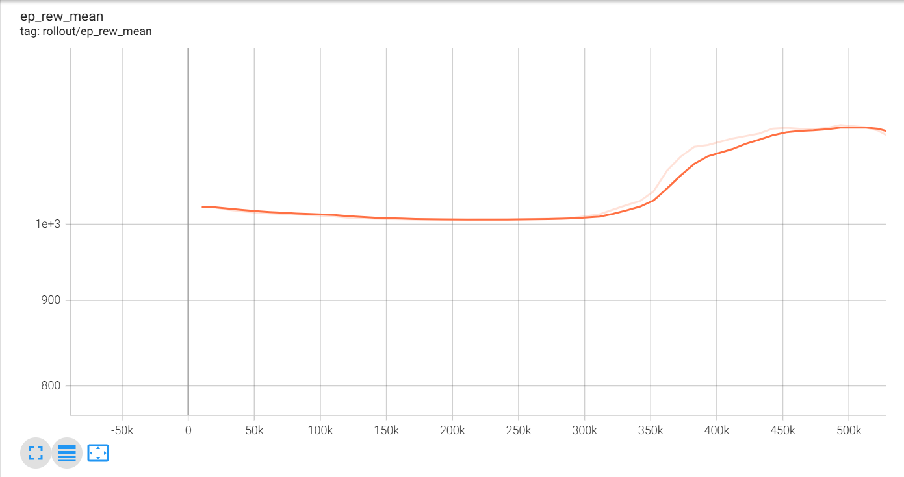

# Auto-Drone Navigation using Deep Reinforcement Learning

## 📌 Note

> 🛠️ **This is an ongoing project.**  
> Future improvements include trajectory planning, multi-axis stabilization, generalization to arbitrary start and target points, and possibly integration with a real drone platform.

This is an **ongoing project** focused on developing an autonomous drone system capable of navigating from an arbitrary start coordinate **A** to a target coordinate **B** using **Deep Reinforcement Learning (DRL)**. The current stage focuses on achieving **stable hovering and altitude control**, which has been successfully implemented.

---


## 📌 Project Objectives  

<p align="center">
  
</p>  

- ✅ **Stabilize the drone at a fixed target altitude using DRL**
- 📚 Completed foundational deep learning courses to support implementation:
  - **Neural Networks and Deep Learning** by Andrew Ng (Coursera)
  - **Improving Deep Neural Networks: Hyperparameter Tuning, Regularization and Optimization** by Andrew Ng (Coursera)
- 🚧 **Extend the control from 1D (z-axis) to full 3D navigation in space**
- 🚧 **Train a policy that generalizes across different target coordinates**
- 🚧 **Incorporate obstacle avoidance and velocity control**

---
## 🛸 Drone Stabilization Demo

<p align="center">
  
</p>

<p align="center">
  
</p>

## 🧠 Algorithms & Tools Used

- **RL Algorithm**: Proximal Policy Optimization (PPO) using `stable-baselines3`
- **Physics Simulation**: PyBullet
- **Environment**: Custom OpenAI Gym-compatible drone simulation environment
- **Programming Language**: Python
- **Other Tools**: NumPy, TensorBoard

---

## 🏗️ Current Progress

- [x] Designed a custom Gym environment for drone simulation  
- [x] Achieved stable hovering at a desired altitude (z-axis control)  
- [x] Defined meaningful reward function, observation & action spaces  
- [ ] Extend control logic to full 3D navigation  
- [ ] Reward shaping for trajectory following from coordinate A to B  
- [ ] Logging and visualization of drone trajectories  

---


## 🚀 How to Run

1. Clone this repo:
   ```bash
   git clone  https://github.com/ak-1203/Autonomous-Drone-Navigation-using-DRL
   cd drone-drl-navigation

